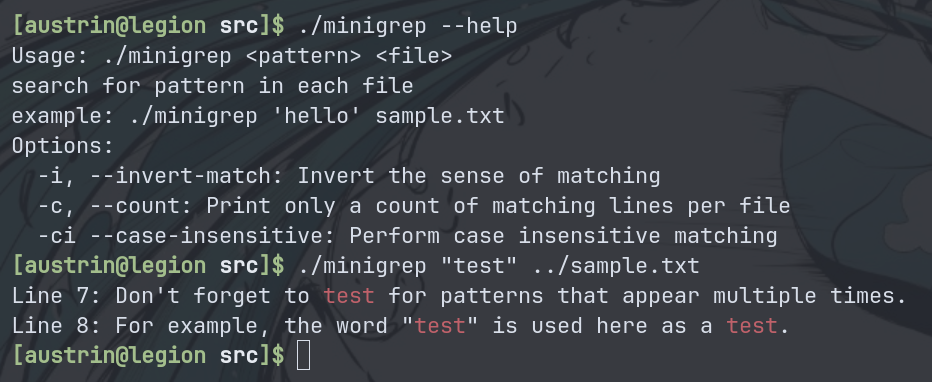

# Minigrep
A simple implementation of grep in C. Minigrep allows you to search for patterns in text files, with support for case-insensitive searches and pattern highlighting.

## Features
- Pattern searching: Locate lines containing a specific pattern within text files and display them.
- Invert searching: Find and display lines that do not contain the specified pattern.
- Number of lines matching: Displays the total count of lines that match the given pattern.
- Case-Insensitive Searching: Perform searches that ignore case differences, enabling matches like pattern, Pattern, and PATTERN.

## Usage



## Installation
1. **Clone the Repository**:
   ```bash
   git clone https://github.com/AUS616/mini-grep.git
2. **Navigate to the Project Directory:**
    ```bash
   cd mini-grep 
3. **Compile:**
   ```bash
   gcc minigrep.c functions.c -o minigrep -Wall       

4. **Run:**
   ```bash
   ./minigrep "test" ../sample.txt
